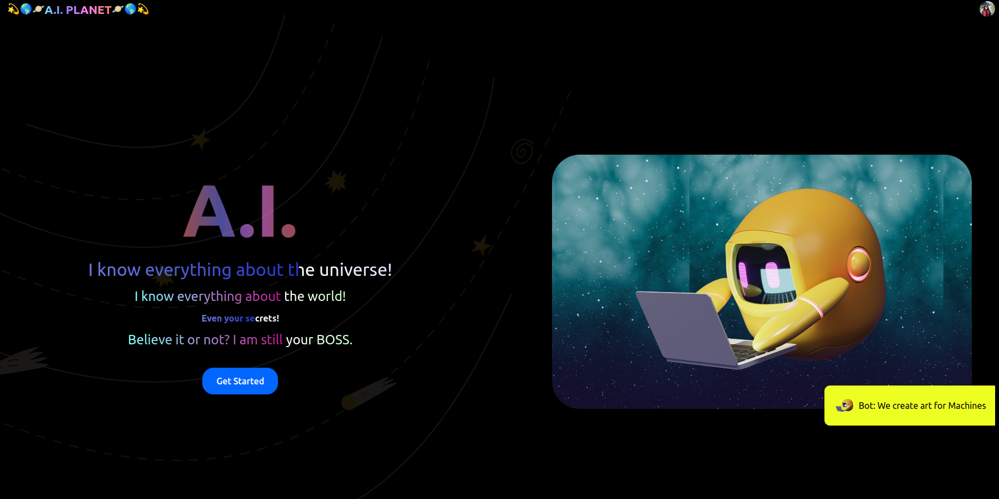
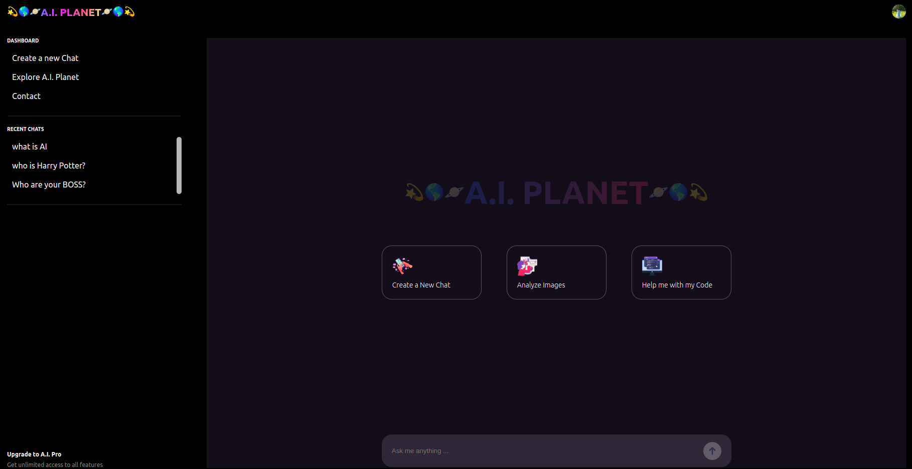

# ChatGPT Clone Fullstack Project

This project is a full-stack implementation of a ChatGPT clone, leveraging modern web technologies to create an interactive and engaging chat application. The stack includes React for the front-end, Express for the back-end, MongoDB for database management, Google Gemini for AI capabilities, Clerk for user authentication, Magekitio-react for image updates, and beautiful animations to enhance user experience.

## Table of Contents

  - [Features](#features)
  - [Technologies Used](#technologies-used)
  - [Screenshots](#screenshots)
    - [HomePage](#homepage)
    - [Dashboard Page](#dashboard-page)

## Features

- **Interactive Chat Interface**: Real-time communication with AI-powered responses.
- **User Authentication**: Secure login and signup using Clerk.
- **Image Updates**: Users can upload and update images with Magekitio-react.
- **AI Integration**: Powered by Google Gemini for advanced AI interactions.
- **Beautiful Animations**: Smooth and engaging animations to enhance user experience.
- **Responsive Design**: Optimized for desktops, tablets, and mobile devices.

## Technologies Used

- **Front-End**: React, Magekitio-react, Tailwind CSS, Animations (CSS & JavaScript)
- **Back-End**: Express.js, Node.js
- **Database**: MongoDB
- **AI Integration**: Google Gemini
- **Authentication**: Clerk
- **Styling**: Tailwind CSS, Custom Animations

## Screenshots

### HomePage

### Dashboard Page

